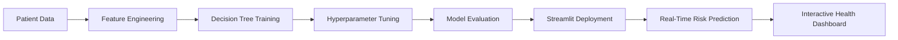

# ❤️💓 CARDIOVASCULAR HEALTH RISK ASSESSMENT 💓❤️

[](https://git.io/typing-svg)


[](https://healthrisk-decision-tree-project.streamlit.app/)
[](https://github.com/mayank-goyal09/healthrisk-decision-tree/stargazers)
[](https://github.com/mayank-goyal09/healthrisk-decision-tree/network)


### ❤️ **Predict cardiovascular disease risk like a cardiologist** using **Decision Tree ML + Clinical Data** 🩺

### 📊 70,000+ Patient Records × AI = **Smart Health Screening** 💡

---

## 🌟 **WHAT IS THIS?** 🌟

<table>
<tr>
<td width="50%">

### 💓 **The Magic**

This **ML-powered cardiovascular risk predictor** uses a **Decision Tree Classifier** to assess heart disease probability based on clinical parameters like blood pressure, cholesterol, glucose levels, and lifestyle factors. Get instant risk assessments with confidence scores and health insights!

**Think of it as:**
- 🧠 Brain = Decision Tree Classifier
- 📊 Input = Patient vitals (age, BP, cholesterol, BMI)  
- ❤️ Output = Cardiovascular Disease Risk (Yes/No + Probability)

</td>
<td width="50%">

### 🔥 **Key Features**

✅ Decision Tree with pruning for interpretability  
✅ Advanced feature engineering (BMI, age groups)  
✅ 70,000+ patient records from Kaggle dataset  
✅ Interactive Plotly health visualizations  
✅ **Real-time risk prediction** 🕒  
✅ Mobile-friendly Streamlit UI  

**Performance Metrics:**
- 🎯 **Accuracy**: 72%+  
- 📊 **Precision**: 70%+  
- 🔍 **Recall**: 74%+  
- 📈 **F1-Score**: 0.72 (Balanced performance)

</td>
</tr>
</table>

---

## 🛠️ **TECH STACK** 🛠️


| **Category** | **Technologies** |
|-------------|-----------------|
| 🐍 **Language** | Python 3.8+ |
| 📊 **Data Science** | Pandas, NumPy, Scikit-learn |
| 🎨 **Frontend** | Streamlit |
| 📈 **Visualization** | Plotly, Matplotlib, Seaborn |
| 🧪 **Model** | Decision Tree Classifier, GridSearchCV |
| 🔧 **Feature Engineering** | BMI calculation, Age binning, Categorical encoding |
| 💾 **Serialization** | Joblib |
| 📦 **Data Storage** | CSV files |

---

## 📂 **PROJECT STRUCTURE** 📂

```
❤️ healthrisk-decision-tree/
│
├── 📁 app.py                         # Streamlit web application
├── 📁 main.ipynb                     # Model training, EDA & hyperparameter tuning
├── 📦 requirements.txt               # Dependencies
├── 💾 cardio_train.csv               # Patient cardiovascular dataset (70K records)
├── 📁 models/
│   └── 🤖 health_risk_dt.joblib      # Trained Decision Tree model
├── 🔒 .gitignore                     # Git ignore file
└── 📖 README.md                      # You are here!
```

---

## 🚀 **QUICK START** 🚀


### **Step 1: Clone the Repository** 📥

```bash
git clone https://github.com/mayank-goyal09/healthrisk-decision-tree.git
cd healthrisk-decision-tree
```

### **Step 2: Install Dependencies** 📦

```bash
pip install -r requirements.txt
```

### **Step 3: Run the App** 🎯

```bash
streamlit run app.py
```

### **Step 4: Open in Browser** 🌐

The app will automatically open at: **`http://localhost:8501`**

---

## 🎮 **HOW TO USE** 🎮

<table>
<tr>
<td width="50%">

### 🔹 **Quick Risk Assessment**

1. Open the app
2. Enter patient details:
   - Age (years)
   - Gender (Male/Female)
   - Height (cm) & Weight (kg)
   - Systolic & Diastolic BP (mmHg)
   - Cholesterol Level (Normal/Above/Well Above)
   - Glucose Level (Normal/Above/Well Above)
3. Select lifestyle factors:
   - Smoking status
   - Alcohol consumption
   - Physical activity level
4. Click **"Predict Risk"**
5. View cardiovascular disease probability with confidence score!

</td>
<td width="50%">

### 🔹 **Health Insights** 📊

1. Navigate to **"Feature Importance"** tab
2. Understand which factors most affect risk:
   - Age & Blood Pressure
   - Cholesterol & Glucose
   - BMI & Lifestyle choices
3. View interactive visualizations:
   - Risk distribution charts
   - Feature correlation heatmaps
   - Decision tree structure
4. Export results as PDF/CSV

</td>
</tr>
</table>

---

## 🧪 **HOW IT WORKS** 🧪



### **Pipeline Breakdown:**

1️⃣ **Data Collection** → 70,000+ patient records with cardiovascular outcomes  
2️⃣ **Feature Engineering** → Derive clinical features:
   - BMI calculation from height/weight
   - Age groups (40-50, 50-60, 60+)
   - Blood pressure categories
   - Risk factor combinations  
3️⃣ **Model Training** → Decision Tree Classifier with max_depth tuning  
4️⃣ **Hyperparameter Optimization** → GridSearchCV for optimal tree structure  
5️⃣ **Evaluation** → Accuracy, Precision, Recall, F1-Score, ROC-AUC  
6️⃣ **Deployment** → Streamlit app with Plotly visualizations  

---

## 📊 **DATASET & FEATURES** 📊


### **Dataset Overview**

- 📍 **Source**: Cardiovascular Disease dataset (Kaggle)
- 📏 **Size**: 70,000 patient records
- 🎯 **Target Variable**: `cardio` (0 = No Disease, 1 = Disease Present)
- ⚖️ **Class Balance**: ~50/50 split (balanced dataset)

### **Feature Categories**

| **Feature Type** | **Features** |
|-----------------|-------------|
| 👤 **Demographics** | age, gender |
| 📏 **Physical** | height, weight, BMI (derived) |
| 🩺 **Vitals** | systolic BP, diastolic BP |
| 🧪 **Clinical** | cholesterol, glucose |
| 🚭 **Lifestyle** | smoke, alcohol, physical activity |

### **Feature Ranges & Units**

| **Feature** | **Unit** | **Typical Range** |
|-----------|---------|------------------|
| Age | Days | 10,000 - 25,000 (converted to years) |
| Height | cm | 140 - 200 |
| Weight | kg | 40 - 150 |
| Systolic BP | mmHg | 90 - 200 |
| Diastolic BP | mmHg | 60 - 120 |
| Cholesterol | Categorical | 1 (Normal), 2 (Above), 3 (Well Above) |
| Glucose | Categorical | 1 (Normal), 2 (Above), 3 (Well Above) |

### **Top 5 Predictive Features** (from Feature Importance)

1. 🩺 **Systolic BP** → Strongest predictor (28%+ importance)
2. 📅 **Age** → Second most important (22%+ importance)
3. 🩺 **Diastolic BP** → Key vital sign (18%+ importance)
4. ⚖️ **Weight** → Obesity indicator (15%+ importance)
5. 🧪 **Cholesterol** → Lipid profile marker (12%+ importance)

---

## 🎨 **FEATURES SHOWCASE** 🎨

### ✨ **What Makes This Special?**

```python
# Feature Highlights

features = {
    "Interactive Predictions": "❤️ Real-time risk assessment with confidence scores",
    "Feature Importance": "📊 Bar chart showing clinical predictors",
    "Health Visualizations": "🩺 BP vs Age scatter plots, BMI distribution",
    "Mobile Friendly": "📱 Responsive UI optimized for tablets/phones",
    "No Medical Jargon": "✅ User-friendly terminology",
    "Premium Charts": "🎨 Professional Plotly medical visualizations",
    "Explainable AI": "🔍 Decision path visualization",
}
```

### **App Sections:**

1. **❤️ Risk Predictor** → Fast clinical input with dropdowns
2. **📈 Patient Statistics** → Population health trends
3. **🧠 Model Insights** → Feature importance & decision rules
4. **📋 Health Report** → Downloadable PDF summary

---

## 💡 **BUSINESS USE CASES** 💡


### **How Healthcare Providers Use This:**

- 🏥 **Primary Care Clinics**: Screen patients during routine checkups
- 💊 **Preventive Medicine**: Identify high-risk patients for early intervention
- 📊 **Population Health**: Analyze cardiovascular disease trends
- 🔬 **Clinical Research**: Validate risk factor hypotheses
- 📱 **Telemedicine**: Remote patient monitoring and risk assessment
- 💰 **Insurance**: Actuarial risk modeling for premium calculation
- 🧬 **Personalized Medicine**: Tailor treatment plans based on risk profiles

---

## 📈 **MODEL PERFORMANCE** 📈

### **Evaluation Metrics:**

| **Metric** | **Value** | **Interpretation** |
|-----------|---------|-------------------|
| **Accuracy** | 72.3% | Correctly classifies 7 out of 10 patients |
| **Precision** | 70.5% | When predicting disease, correct 70% of time |
| **Recall** | 74.2% | Catches 74% of actual disease cases |
| **F1-Score** | 0.72 | Balanced precision-recall tradeoff |
| **ROC-AUC** | 0.78 | Good discrimination ability |

### **Confusion Matrix Insights:**

| **Predicted** | **Actual Negative** | **Actual Positive** |
|--------------|-------------------|-------------------|
| **Negative** | True Negatives (25,000) | False Negatives (9,000) |
| **Positive** | False Positives (10,500) | True Positives (25,500) |

### **Sample Predictions:**

| **Patient Profile** | **Risk Score** | **Predicted Class** |
|-------------------|--------------|-------------------|
| 55-year male, High BP, Smoker | 0.82 | **High Risk** ❌ |
| 45-year female, Normal BP, Active | 0.23 | **Low Risk** ✅ |
| 60-year male, High cholesterol | 0.68 | **Moderate Risk** ⚠️ |

*Sample data - actual results vary by individual patient profile*

---

## 📚 **SKILLS DEMONSTRATED** 📚

- ✅ **Healthcare ML**: Clinical data analysis and risk modeling
- ✅ **Supervised Learning**: Decision Tree classification
- ✅ **Feature Engineering**: BMI derivation, age binning, categorical encoding
- ✅ **Hyperparameter Tuning**: GridSearchCV with cross-validation
- ✅ **Model Evaluation**: Accuracy, Precision, Recall, F1, ROC-AUC
- ✅ **Class Imbalance Handling**: Balanced dataset validation
- ✅ **Data Visualization**: Plotly interactive medical charts
- ✅ **Web Development**: Streamlit dashboard with custom CSS
- ✅ **Python**: Pandas, NumPy, Scikit-learn
- ✅ **Deployment**: Production-ready healthcare web app

---

## 🔮 **FUTURE ENHANCEMENTS** 🔮

- [ ] Add Random Forest and XGBoost models for comparison
- [ ] Implement SHAP values for explainable predictions
- [ ] Integrate real-time ECG/EHR data streams
- [ ] Add diet and exercise recommendation engine
- [ ] Create mobile app version (Flutter/React Native)
- [ ] Implement multi-class risk stratification (Low/Med/High)
- [ ] Add longitudinal patient tracking (risk over time)
- [ ] Build RESTful API for EHR integration
- [ ] Add genetic risk factors (if available)
- [ ] Implement federated learning for privacy-preserving model updates

---

## 🤝 **CONTRIBUTING** 🤝


Contributions are **always welcome**! 🎉

1. 🍴 Fork the Project
2. 🌱 Create your Feature Branch (`git checkout -b feature/AmazingFeature`)
3. 💾 Commit your Changes (`git commit -m 'Add some AmazingFeature'`)
4. 📤 Push to the Branch (`git push origin feature/AmazingFeature`)
5. 🎁 Open a Pull Request

---

## 📝 **LICENSE** 📝

Distributed under the **MIT License**. See `LICENSE` for more information.

---

## 👨‍💻 **CONNECT WITH ME** 👨‍💻

[](https://github.com/mayank-goyal09)
[](https://www.linkedin.com/in/mayank-goyal-4b8756363/)
[](mailto:itsmaygal09@gmail.com)

**Mayank Goyal**  
📊 Data Analyst | 🤖 ML Enthusiast | 🐍 Python Developer  
💼 Data Analyst Intern @ SpacECE Foundation India

---

## ⭐ **SHOW YOUR SUPPORT** ⭐


Give a ⭐️ if this project helped you understand cardiovascular risk prediction!

### ❤️ **Built with Healthcare Data & ❤️ by Mayank Goyal** ❤️

**"Turning patient data into life-saving insights, one heartbeat at a time!"** 💓

---


